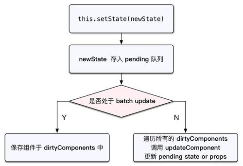

https://react.iamkasong.com/preparation/oldConstructure.html#react15%E6%9E%B6%E6%9E%84


React15架构可以分为两层：

* Reconciler（协调器）—— 负责找出变化的组件
* Renderer（渲染器）—— 负责将变化的组件渲染到页面上

**React15架构的缺点** 

在Reconciler中，mount的组件会调用mountComponent (opens new window)，update的组件会调用updateComponent (opens new window)。这两个方法都会递归更新子组件。


**递归更新的缺点**

于递归执行，所以更新一旦开始，中途就无法中断。当层级很深时，递归更新时间超过了16ms，用户交互就会卡顿。

React16架构可以分为三层：

* Scheduler（调度器）—— 调度任务的优先级，高优任务优先进入Reconciler
* Reconciler（协调器）—— 负责找出变化的组件
* Renderer（渲染器）—— 负责将变化的组件渲染到页面上


从v16.3.0开始如下三个生命周期钩子被标记为UNSAFE。

https://juejin.cn/post/6847902224287285255

* componentWillMount

* componentWillRecieveProps

* componentWillUpdate


### React 合成事件

1. event 是 SyntheticEvent，模拟出来的 DOM 事件能力

2. event.nativeEvent 是原生事件对象

3. 所有事件，都被挂载到 document 上
 
4. 和 DOM 事件不一样，和 Vue 事件也不一样


 ### setState是同步还是异步  


 ###  生命周期


static getDerivedStateFromProps()
shouldComponentUpdate() 
render()
getSnapshotBeforeUpdate()
componentDidUpdate()


### 性能优化  SCU


SCU 默认返回true, 即 React 默认，父组件有更新，子组件则无条件更新！

必须配合 “不可变值”  一起使用

// SCU 一定要每次都用吗？

直接 this.state.array.push() 会有问题


PureComponent, SCU 中实现了浅比较。

### immutable.js

彻底拥抱 "不可变值"

基于共享数据 (不是深拷贝),速度好
 
有一定的学习和迁移成本，按需使用


### HOC  vs   Render Props

HOC: 模式简单，但会增加组件层级

Render Props: 代码简洁，学习成本较高。


### Redux 使用

基本概念

store state  action  reducer

单项数组流概述

* dispatch(action) 
* reducer  -> newState
* subscribe 触发通知 

 
redux 数据流图


### setState 和 batchUpdate 





变量：

isBatchingUpdates


setState 异步还是同步？

* setState 无所谓异步还是同步
* 看是否能命中 batchUpdate 机制
* 判断 isBatchingUpdates 


哪些能命中 batchUpdate 机制

* 生命周期 (和它调用的函数)
* React 中注册的事件(和它调用的函数)
* React 可以管理 的入口


哪些不能命中  batchUpdate 机制

* setTimeout setInterval 等(和它调用的函数)
* 自定义的 DOM 事件 
* React 管不到的入口


更新的两个阶段

* 上述的 patch 被拆分为两个阶段

reconciliation 阶段 - 执行 diff 算法，纯  JS 计算。

commit 阶段  将 diff 结果渲染到 DOM 中

上面存在的性能问题

* JS 是单线程的，，且和 DOM 渲染共用一个线程
* 当组件足够复杂，组件更新时计算和渲染都压力大
* 同时再有 DOM 操作需求(动画、鼠标拖拽等)，会卡顿


解决方案 fiber

* 将 reconciliation 阶段进行任务拆分 (commit 无法拆分)
* DOM 需要渲染时暂停，空闲时恢复
* window.requestIdleCallback() 


### 函数组件和 class 组件区别

* 纯函数，输入 props，输出 JSX
* 没有实例，没有生命周期，没有 state
* 不能扩展其它方法


### 多个组件有公共逻辑，如何抽离

* HOC
* render props


 ### react-router 如何配置懒加载

```
const Home = lazy(() => import('./routes/Home'));
const About = lazy(() => import('./routes/About'));

<Router>
  <Suspense fallback={<div>Loading...</div>}>
    <Switch>
      <Route exact path="/" component={Home}>
    </Switch>
  </Suspense>
</Router>
 ```


### React 事件和DOM事件的区别

* 所有事件挂载到 document 上
* event 不是原生的，是 SyntheticE vent 合成事件对象
* dispatchEvent


为何要合成事件机制？

* 更好的兼容性和跨平台
* 挂载到 document，减少内存消耗，避免频繁解绑


