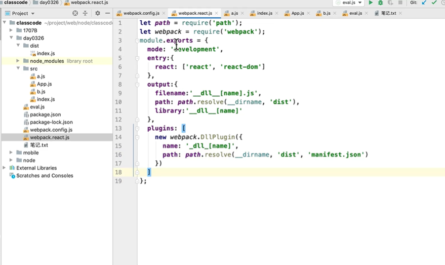

  


### module chunk bundle 的区别


* module -  各个源码文件，webpack 中一切皆模块
* chunk - 多模块合成的，如果 entry  import() splitChunk
* bundle - 最终的输出文件


###  优化

优化 babel-loader ，使用 exclude  排除

IgnorePlugin  直接不引入，代码中没有

noParse 引入，但不打包


 **happyPack 多进程打包**

* JS 单线程，开启多进程打包
* 提高构建速度(特别是多核 CPU)


**ParallelUglifyPlugin** 多进程压缩 JS
 


### DllPlugin 动态链接库插件

watch: true 


### 使用 production

* 自动开启代码压缩
* Vue React 会自动删除调试代码(如开发环境的 warning)
* 启动 Tree-Shaking

 
### ES6 Module 和 CommonJS 区别

* ES6 Module 静态引入，编译时引入
* CommonJs 动态引入，执行时引入
* 只有 ES6 Module 才能静态分析，实现 Tree-Shaking

 ```
 let apiList = require('../config/api.js')
 if (isDev) {
   // 可以动态引入，执行时引入
   apiList = require('../config/api_dev.js')
 }
 ``` 

 ```
 import apiList from '../config/api.js'

 if (isDev) {
   // 编译时报错，只能静态引入 
   immport apiList from '../config/api_dev.js'
 }
 ```


 ### 为何 Proxy 不能被 Polyfill ?

* 如 Class 可以用 function 模拟
* 如 Promise 可以用 callback 来模拟
* 但 Proxy 的功能用 Object.defineProperty 无法模拟


### Web 动态加载原理

https://www.cnblogs.com/woai3c/p/13669933.html

重写 window["webpackJsonp"].push() 方法。
入口模块使用 __webpack_require__.e() 下载动态资源。
资源下载完成后执行 window["webpackJsonp"].push()，即 webpackJsonpCallback()。
将资源标识为 0，代表已经加载完成。由于加载模块使用的是 Promise，所以要执行 resolve()。
再看一下入口模块的加载代码 __webpack_require__.e(0).then(__webpack_require__.bind(null, "./src/test2.js"))，下载完成后执行 then() 方法，调用 __webpack_require__() 真正开始加载代码，__webpack_require__() 在上文已经讲解过，如果不了解，建议再阅读一遍。


### webpack打包原理及优化

https://www.bilibili.com/video/BV1eC4y147RX?from=search&seid=8252948110151683140

https://bingyu123.gitee.io/blog/

1.webpack 打包之后的文件
  1) 自执行函数
  2) 参数通过对象的形式传递的
     key: 文件的路径   value 是一个函数
     eval 执行字符串代码
     如果有多个相互依赖的文件，最终打包了一个文件 
  3）怎么把所有的文件 打包之后形成一个文件  __webpack_require__
  4) 原理 通过递归的方式不停的调用自己
   
优化：
  小白： 使用懒加载  热更新  不用的不引入
  大牛：
     自带优化：
      tree-sharking：依赖 
      scope-hoisting：作用域提升，变量--> 结果 不会打包到代码中

     自己实现优化
      速度
        happypack: 多线程打包   注意：体积比较小  打包的时候比较慢
      
      体积
        monent：时间插件  引入  很多语言包不需要的
        IgnorePlugin 就会把不需要的语言包删除

        html  cdn 地址 jquery  打包的时候  打包到压缩文件中  体积爆炸
        externals: {
          'jquery': '$'
        }
        modules: {
          noParse: /jquery/
        }
      
      打包完了之后，体积过大  20M  10M
       拆：公共的文件：react/react-dom/vue/
       动态链接库：
        一些想要提取出来的包：react/react-dom
        放到一个单独的文件打包，最后可以放到 cdn 上，加载速度就更快了

      
      代码优雅程序：
        autoprefixer:加载前缘
        babel-loader: 插件引入
